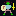
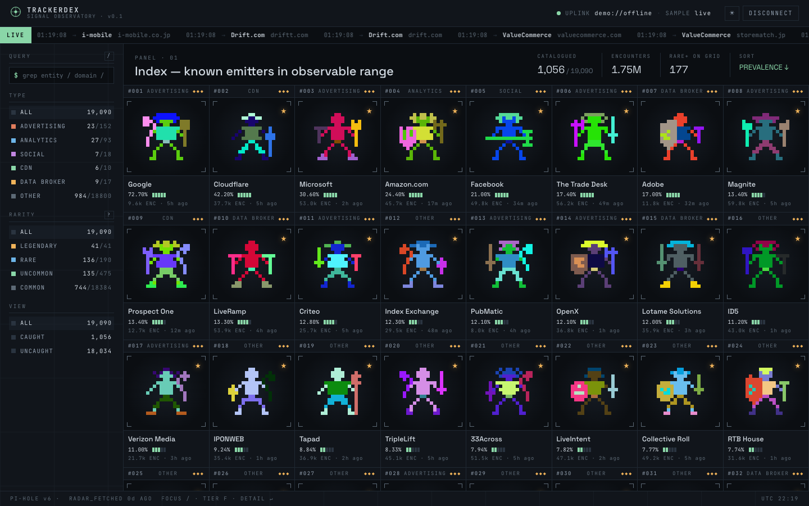
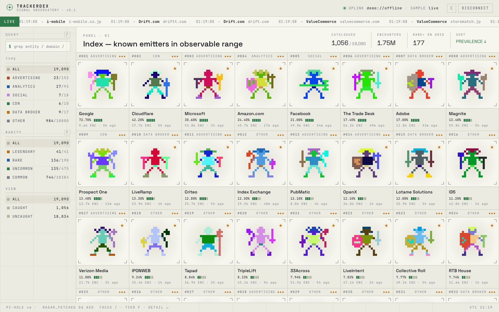
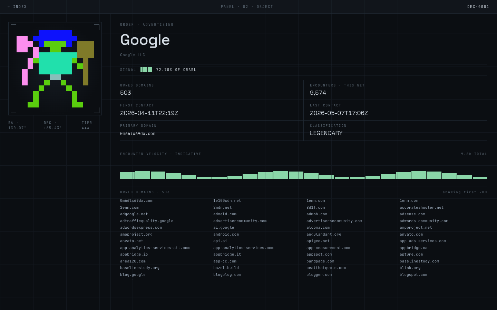

<p align="center">
  
</p>

<h1 align="center">
  Trackerdex
  <br>
  <sub><sup>a bestiary of internet trackers, populated by your Pi-hole</sup></sub>
</h1>

<p align="center">
  built for <a href="https://pi-hole.net">Pi-hole</a> &nbsp;
  <a href="https://pi-hole.net"></a>
</p>

<p align="center">
  <a href="https://github.com/milouk/trackerdex/actions/workflows/build.yml"></a>
  <a href="https://milouk.me/projects/trackerdex/"></a>
  <a href="https://github.com/milouk/trackerdex/pkgs/container/trackerdex"></a>
  <a href="https://github.com/milouk/trackerdex"></a>
  <a href="https://github.com/milouk/trackerdex/commits/main"></a>
  <a href="LICENSE"></a>
  <a href="https://ko-fi.com/milouk"></a>
</p>

<p align="center"><em>Gotta block 'em all!</em></p>

> A companion to [**Pi-hole**](https://pi-hole.net/). Every blocked DNS query
> turns into a *catch* in your personal dex of ~19,000 internet trackers,
> each rendered as a deterministic 16×16 RPG character. Tiers (legendary /
> rare / uncommon / common) reflect how widely each tracker is deployed
> across the web. Watch your dex fill up over hours of normal browsing.

Live data via the [Pi-hole v6 REST API](https://docs.pi-hole.net/api/).
Real entity catalogue from
[DuckDuckGo Tracker Radar](https://github.com/duckduckgo/tracker-radar).
Sprite engine ported from [daboth/pagan](https://github.com/daboth/pagan).

**🛰️ Live demo: <https://milouk.me/projects/trackerdex/>**

Zero-config self-host: `docker run -p 8080:80 ghcr.io/milouk/trackerdex:latest` — done.

## What is it

Trackerdex turns your Pi-hole's `/api/queries` and `/api/stats/top_domains`
endpoints into a Pokédex-style game where the "monsters" are real ad
networks, analytics platforms, social trackers, CDNs, and data brokers.

Every blocked DNS query is an encounter. The first time your network
blocks a tracker we have on file, you *catch* it — its sprite is unlocked,
its silhouette becomes a real character, and an entry joins your dex.

The dex is shared across users (the same domain → the same character for
everyone), but your **catch state** lives only in your browser's
`localStorage`. No accounts, no telemetry, no cloud — just you and your
Pi-hole.

## Themes

Dark default, light optional. Toggle in the topbar.

### Dark



### Light



### Detail · sprite overview

Click any catch for the full file: signal strength bars, fake astronomical
coordinates, full-size sprite (with shiny variant if you've broken
15,000 encounters), the tracker's owned domains, and a 24-hour encounter
sparkline.



## Quickstart

### Docker — auto-connect (recommended)

Pass your Pi-hole password as an env var and trackerdex logs in for you on
every page load. The container's bundled nginx reverse-proxies `/api/*` to
the `pihole` container on the same network, so the browser only ever talks
to its own origin (no CORS, no Pi-hole config changes).

```bash
docker run -d \
  --name trackerdex \
  --network <your-pihole-network> \
  -p 8080:80 \
  -e PIHOLE_PASSWORD=<your-pi-hole-app-password> \
  ghcr.io/milouk/trackerdex:latest
```

Open `http://<host>:8080` → you land directly on your dex.

### Docker — manual connect

Skip the env var and you'll get the connect screen on first visit; type
your Pi-hole URL + password, the session token is kept in `localStorage`.

```bash
docker run -d --name trackerdex -p 8080:80 ghcr.io/milouk/trackerdex:latest
```

### docker-compose

```yaml
services:
  trackerdex:
    image: ghcr.io/milouk/trackerdex:latest
    container_name: trackerdex
    restart: unless-stopped
    ports:
      - "8080:80"
    env_file:
      - ./trackerdex.env       # PIHOLE_PASSWORD=...
    # If your Pi-hole isn't reachable as `pihole` on the same docker
    # network, also set:
    #   PIHOLE_UPSTREAM=http://<container-or-host>[:port]
```

`./trackerdex.env`:

```dotenv
PIHOLE_PASSWORD=your-pi-hole-app-password
# Optional — only set if you need the SPA to point at a different host
# than the one the page is served from. Leave unset for same-origin
# (the default; works with the bundled nginx /api/* proxy).
# PIHOLE_HOST=https://pihole.example.com
```

### Environment variables

- **`PIHOLE_PASSWORD`** — *required for auto-connect, default unset.*
  When set, the SPA fetches `/config.json` on boot and `POST /api/auth`
  automatically; lands on the dex without showing the connect screen.
  Operator-supplied env vars take priority over any stale localStorage
  session.

- **`PIHOLE_HOST`** — *optional, default unset (same-origin).*
  Override the URL the SPA hits for the API. Leave blank to use
  same-origin (recommended; nginx proxies `/api/*` to the `pihole`
  upstream). Set if your Pi-hole is reachable elsewhere and you'd rather
  the browser hit it directly.

> **Heads-up about exposure.** `PIHOLE_PASSWORD` ends up in the
> publicly-readable `/config.json` so the SPA can pick it up at boot. Only
> set it on deployments where access is already restricted (LAN, behind
> auth at your reverse proxy). For public deployments, leave it unset and
> let users connect manually.

### From source (development)

```bash
git clone https://github.com/milouk/trackerdex.git
cd trackerdex
npm install
npm run build:dex      # downloads Tracker Radar (~5 MB dex.json)
echo 'VITE_PIHOLE_URL=http://pihole.lan' > .env.local
npm run dev            # http://localhost:5173
```

In dev mode, Vite proxies `/api/*` to `VITE_PIHOLE_URL` so the browser
treats Pi-hole as same-origin — no CORS dance.

## How it works

```text
                  ┌────────────────────┐
                  │  Tracker Radar     │  build-time fetch
                  │  (~3.8k entities,  │  via npm run build:dex
                  │   ~38k domains)    │
                  └────────┬───────────┘
                           ▼
                  ┌────────────────────┐
                  │   public/dex.json  │  flat domain→entity index
                  │   ~5 MB            │  + per-entity metadata
                  └────────┬───────────┘
                           ▼ static fetch
        Pi-hole v6  ───►  trackerdex SPA  ◄─── pagan-derived sprites
        /api/queries        │                   (in-browser canvas)
        /api/stats/...      ▼
                       localStorage
                       (catch progress)
```

1. **Build time**: pull DuckDuckGo Tracker Radar's
   `domain_map.json` (~38k subdomains → 3.8k parent companies) and
   `entity_prevalence.json`. Join into one flat `domain → entity` index
   with tiered metadata. Output: `public/dex.json`.

2. **First run**: the SPA `POST /api/auth` with your Pi-hole password,
   stashes the session ID, then bulk-seeds your catches from
   `/api/stats/top_domains?blocked=true&count=1000`.

3. **Live polling**: every 8 seconds, fetch the latest queries from
   `/api/queries?from=<since>`, filter to blocked statuses (GRAVITY,
   REGEX, DENYLIST, …), strip subdomains via the Public Suffix List, look
   up the parent entity, and increment the encounter counter.

4. **Sprite rendering** is pure browser code: each entity name is hashed
   (chained 32-bit FNV-1a) to seed pagan's algorithm — body silhouette,
   hair, clothing, weapon, optional shield + decoration — composited into
   a 16×16 deterministic character. Same name in, same character out.

## Tiers and rarity

Tier comes from Tracker Radar's prevalence stat — what fraction of the
crawled web includes this tracker. **Higher tier = more influential, not
harder to catch.**

| Tier      | Threshold | Count  | Examples                            |
|-----------|-----------|--------|-------------------------------------|
| LEGENDARY | ≥ 5%      | 41     | Google, Cloudflare, Meta, Adobe     |
| RARE      | ≥ 0.5%    | 190    | Criteo, Index Exchange, MediaMath   |
| UNCOMMON  | ≥ 0.05%   | 475    | Smaller ad-tech, regional networks  |
| COMMON    | rest      | 18,384 | Long-tail / single-site trackers    |

A tracker becomes **shiny** at ≥15,000 cumulative encounters in your
network — its sprite flips to a different deterministic loadout (same for
every user; everyone's shiny Google looks identical).

## CORS & hosting

The trackerdex container ships with an nginx reverse proxy that forwards
`/api/*` to a Pi-hole upstream on the docker network, so the SPA only
ever talks to its own origin — **no CORS configuration on Pi-hole's side
is needed**, and `PIHOLE_PASSWORD` never has to be exposed to a different
host.

```text
browser ──► trackerdex (nginx) ──► /api/* proxy ──► pihole container
                  ▲                                       │
                  └─────────── same-origin ───────────────┘
```

The default upstream is `http://pihole/` (the conventional container
name). If your Pi-hole has a different name on the network, override
with `PIHOLE_UPSTREAM=http://<name>[:port]`.

If you'd rather have the browser talk to Pi-hole directly (skipping the
proxy), set `PIHOLE_HOST=https://pihole.example.com` — but you'll then
need to allowlist trackerdex's origin in Pi-hole's
`/etc/pihole/pihole-FTL.toml` (or via Traefik/Caddy headers if you
front-end them with a reverse proxy).

> **App passwords.** Generate an app password under *Pi-hole → Settings →
> API* rather than using your main admin password. Trackerdex's
> `/config.json` (and `localStorage`) carries only that app password,
> never your main one.

## Tech stack

- **Frontend**: TypeScript, React 19, Vite, no runtime UI framework
- **Sprites**: TypeScript port of [daboth/pagan](https://github.com/daboth/pagan)
  with all 22 `.pgn` templates — body, hair, torso, boots, 6 one-handers,
  5 two-handers, 4 shields, shield deco
- **Data**: [DuckDuckGo Tracker Radar](https://github.com/duckduckgo/tracker-radar)
- **Hash**: chained 32-bit FNV-1a (deterministic, sync, non-cryptographic)
- **PSL**: [`tldts`](https://github.com/remusao/tldts) for registrable-domain extraction
- **Persistence**: `localStorage` only
- **Deploy**: nginx + Docker (multi-arch ghcr image)

## For nerds

A grab bag of implementation lore for the curious.

### Sprite generation

Every tracker is rendered with a TypeScript port of
[daboth/pagan](https://github.com/daboth/pagan) (GPL-2.0). At runtime,
for each entity name:

1. Hash the name with chained 32-bit **FNV-1a**
   ([src/utils/hash.ts](src/utils/hash.ts)). Each round mixes the previous
   output back in so successive 8-char chunks aren't correlated. We keep
   running until we have ≥48 hex chars — that's what pagan's grinder
   expects.
2. Slice the hash: the first 48 chars become 8 RGB colors; chars 0–6
   pick a "clothing aspect" (one of 16 combos of HAIR/PANTS/TOP/BOOTS);
   chars 6–12 pick a "weapon loadout" (one of 71 — 5 two-handers + 6
   one-handers + 36 dual-wields + 24 weapon+shield pairs).
3. For each chosen layer, parse the matching `.pgn` template (18×18
   ASCII grid; `o` = fixed pixel, `+` = optional based on a hash digit
   modulo 2). Mirror around column 8 for body parts; weapons stay
   asymmetric. Hand-designed templates ship under
   [src/sprite-templates/](src/sprite-templates/) — 22 of them total.
4. Composite in pagan's order: **body → torso → hair → subfield →
   boots → weapon A → weapon B → shield deco**. Each layer reads its own
   color from the 8-color palette (palette index per layer is hard-wired
   to match the reference).

Output: a 16×16 grid of RGB tuples or `null` (transparent), rendered to
canvas at the requested scale (6 in cards, 16 in detail).

Sprites are **cached globally** — the algorithm runs at most once per
unique seed for the lifetime of the page. The cache is **pre-warmed on
idle** for the top 240 entries right after `dex.json` loads, so the
first scroll has no jank.

### The shiny mechanic

A tracker becomes shiny at **≥15,000 cumulative encounters** in your
network. The sprite seed flips from `"Google"` to `"Google::shiny1"`,
producing a different deterministic loadout (different aspect, weapons,
colors — same algorithm). Because the seed is fully deterministic,
**everyone's shiny Google looks identical**. There's no per-user
randomization anywhere in the project.

### Pagan algorithm parity

The TS port is faithful enough that the same entity name produces the
same output as the Python reference. The arithmetic in the grinder
(`mapDecision = numDecisions / (MAX+1) × (digitsum+1)` and
`chooseFromList`'s "return the last entry whose index is strictly less
than the decision") is reproduced verbatim — including the edge case
where decisions ≤ 0 return an empty list (which means "no aspect / no
weapon"; rare in practice with a hash chunk of `000000`, but the parity
matters).

Spot-check sample (matches between Python ref and our TS):

| Entity     | Aspect                       | Weapons              |
|------------|------------------------------|----------------------|
| Google     | hair + pants                 | hammer + dagger      |
| Cloudflare | hair + pants + boots + top   | round shield + mace  |
| Adobe      | hair + pants + boots + top   | wand (two-handed)    |
| LiveRamp   | boots                        | shield + hammer      |

### The astronomical coordinates

The detail page shows fake **RA** (Right Ascension) and **DEC**
(Declination) numbers to sell the "signal observatory" aesthetic. They
aren't real positions:

- `RA  = (entityName.length × 13) mod 360 °`
- `DEC = prevalence × 90 °`

Pure flavor. Hover the labels for an in-app tooltip that says so.

### Domain rollup

Pi-hole logs queries at the **subdomain** level (e.g.
`pubads.g.doubleclick.net`). Trackerdex strips to the **registrable
domain** via the Public Suffix List (`tldts`), then resolves it through
a flat `domain → entityId` map shipped in `dex.json`. So
`pubads.g.doubleclick.net` → `doubleclick.net` → `Google`. This is why
~50 different Google subdomains all map to the same monster.

The map is built once by [scripts/build-dex.ts](scripts/build-dex.ts)
from DuckDuckGo Tracker Radar:

- `domain_map.json` — ~38k subdomains keyed to entity name
- `entity_prevalence.json` — ~3.8k entities with web prevalence (% of
  crawled web that includes them)

Joined into `public/dex.json` (~5 MB raw, ~700 KB gzipped).

### Tier thresholds

Computed at build time from each entity's prevalence:

| Tier      | ≥ Prevalence | Count   | Glyph |
|-----------|--------------|---------|-------|
| LEGENDARY | 5%           | 41      | ◆◆◆   |
| RARE      | 0.5%         | 190     | ◆◆·   |
| UNCOMMON  | 0.05%        | 475     | ◆··   |
| COMMON    | rest         | 18,384  | ···   |

Higher tier ≠ harder to catch — quite the opposite. LEGENDARY trackers
are everywhere, so they're the easiest to catch. The naming is
"legendary in scale," not Pokémon-style legendary rarity. There's a
tooltip on the RARITY sidebar header that says so.

### Demo mode

When you click **EXPLORE THE DEMO** on the connect screen,
[src/demo.ts](src/demo.ts) builds a deterministic catch state:

- 100% of legendaries, 70% rares, 30% uncommons, 4% commons (decided by
  `FNV1a(entity.id) mod 100 < tier.pct`).
- Encounter counts span each tier's range so a few legendaries cross
  the 15k shiny threshold.
- First-seen and last-seen timestamps are derived from the same hash.

Synthetic live events use a pre-computed weighted cumulative array
sampled at a 4.5-second tick:

```text
LEGENDARY 8× : RARE 3× : UNCOMMON 2× : COMMON 1×
```

Demo state is in-memory only; clicking *DISCONNECT* restores your real
catches from `localStorage`. The `localStorage` write is also skipped
while in demo mode so synthetic data can't leak into a real user's
saved state.

### Pi-hole v6 specifics

[src/pihole.ts](src/pihole.ts) speaks the v6 REST API:

- `POST /api/auth { password }` → session ID, sent on subsequent
  requests via the `X-FTL-SID` header.
- `GET /api/stats/top_domains?blocked=true&count=1000` — bulk-seeds
  the dex on connect.
- `GET /api/queries?from=<since>` polled every **8 seconds**.

Statuses considered "blocked":

```text
GRAVITY · REGEX · DENYLIST · *_CNAME variants
EXTERNAL_BLOCKED_IP · EXTERNAL_BLOCKED_NULL · EXTERNAL_BLOCKED_NXRA
DBBUSY · SPECIAL_DOMAIN
```

In dev, [vite.config.ts](vite.config.ts) proxies `/api/*` to
`VITE_PIHOLE_URL` so the browser sees Pi-hole as same-origin — no CORS
config required on the Pi-hole side.

### Performance plumbing

Most of this you won't notice, which is the point:

- **Sprite cache** — `Map<seed, Sprite>`, no eviction (~40 KB live
  for 19k entities).
- **Idle pre-warm** — top 240 sprites pre-generated via
  `requestIdleCallback` after dex loads.
- **`<link rel="preload">`** on `dex.json` so the 5 MB fetch starts
  during JS download instead of after.
- **`React.memo`** on Card / Sidebar / PanelHead with stable
  callbacks — feed updates and catch increments don't cascade through
  240 visible cards.
- **Debounced `localStorage` writes** — 400 ms; bulk-seeding 1000
  entries doesn't trigger 1000 `JSON.stringify` cycles.
- **Marquee paused** when the tab is hidden — Page Visibility API
  toggles `animation-play-state: paused` on the live ticker.
- **`useLayoutEffect`** for canvas painting — no flash of empty
  canvas during scroll-driven remounts.
- **Render cap** — 240 cards on screen max, sort applied first; the
  "+N more" placeholder card tells you to narrow the filter.
- **Domain resolver** — exact `domainMap` hit tried first; PSL parse
  is the fallback.
- **Synthetic ticker** — weighted cumulative array, O(log n) per tick.

### Sizes

```text
JS bundle:   343 KB raw  / 115 KB gzipped
CSS:          20 KB raw  /   4 KB gzipped
HTML:        1.0 KB raw  /  ~0.5 KB gzipped
dex.json:    5.2 MB raw  / ~700 KB gzipped
```

The dex is the heavyweight; everything else is small.

### Why GPL-2.0?

Because pagan is GPL-2.0 and we ship its `.pgn` templates verbatim.
Without the templates the procgen wouldn't have hand-designed body
parts; with them, the project must inherit the license. Forks must
remain GPL-2.0 or compatible. If you need MIT-style licensing, fork
just the non-pagan modules (`pihole.ts`, `dex.ts`, the Observatory UI,
etc.) — all of which are independently authored.

## Credits

- Tracker data: [DuckDuckGo Tracker Radar](https://github.com/duckduckgo/tracker-radar) (Apache-2.0).
- Sprite engine and `.pgn` templates: [daboth/pagan](https://github.com/daboth/pagan) (GPL-2.0).
- Built on top of [Pi-hole](https://pi-hole.net/) v6.

Not affiliated with The Pokémon Company. The "dex" framing is parody.

## License

GPL-2.0-or-later — see [LICENSE](./LICENSE).

This project is GPL-2.0 because it incorporates pagan's templates and
algorithm verbatim. Forks must remain GPL-2.0 or compatible.
